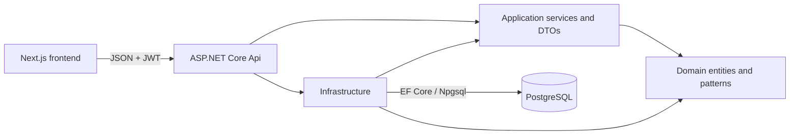
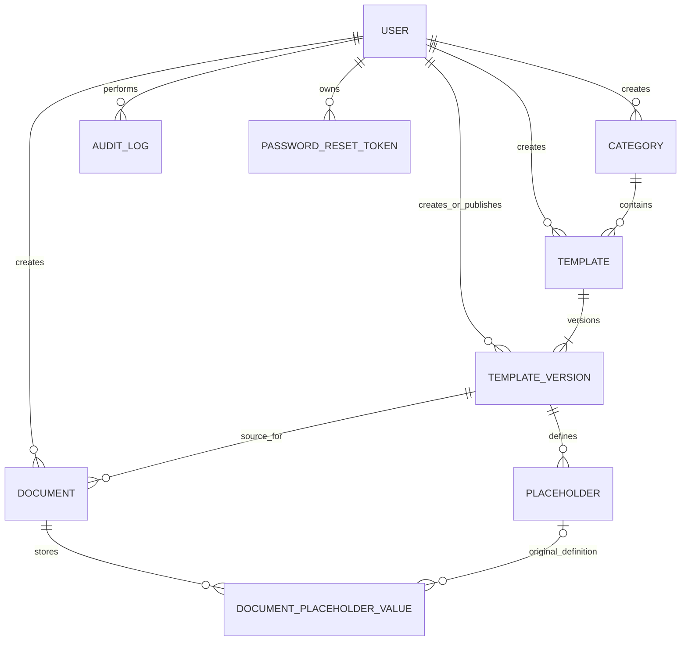
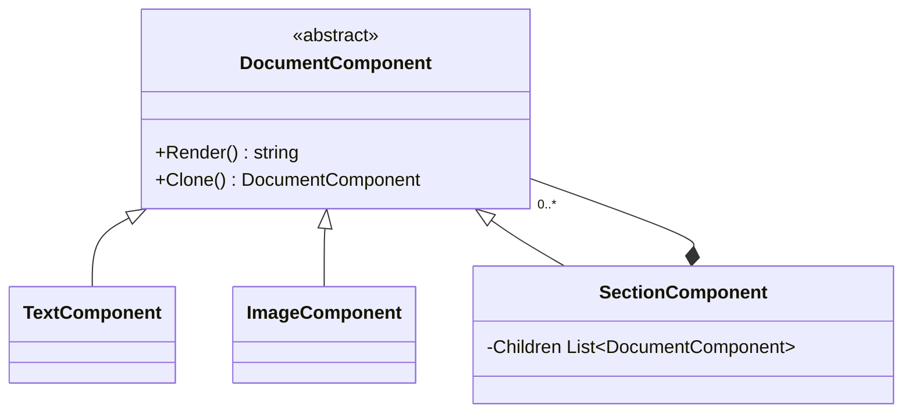

# Architecture

Status: **implemented architecture through Phase 6H with the Phase 7B
QA/deployment-readiness checkpoint complete**.

This document is an implementation view of the approved model in `AGENTS.md`.
The repository does not contain a separate approved ERD or Class Diagram file;
the diagrams below were verified against the Domain entities, EF Core
configurations, migration, application services, API controllers, and frontend
integration. If a separately approved diagram is added later, it must be
reconciled before a breaking model change.

## System structure

Dependencies point inward: Domain has no EF Core or API dependency;
Application coordinates use cases and owns transport DTOs/interfaces;
Infrastructure implements persistence, JWT, hashing, rendering, and repository
interfaces; Api handles HTTP, authorization, validation boundaries, middleware,
Swagger, exact-origin CORS, security headers, public-auth rate limiting, and
separate liveness/readiness health routing. Controllers delegate workflows to
Application services.

## Domain and persistence model

The database contains `Users`, `Categories`, `Templates`, `TemplateVersions`,
`Placeholders`, `Documents`, `DocumentPlaceholderValues`, `AuditLogs`, and
`PasswordResetTokens`.
Important enforcement is split deliberately across layers:

- unique indexes protect `User.Username`, `User.Email`,
  `(TemplateVersion.TemplateId, VersionNumber)`, and
  `(Placeholder.TemplateVersionId, Key)`, plus reset-token hashes;
- a filtered unique index permits at most one current TemplateVersion per
  Template;
- `CK_TemplateVersions_CurrentRequiresPublished` prevents a Draft version from
  being Current;
- domain methods prevent Published TemplateVersion mutation and Finalized
  Document mutation;
- historical relationships use `Restrict`, except the optional Placeholder
  reference on a saved value uses `SetNull` while snapshot fields remain;
- no public workflow hard-deletes Templates, TemplateVersions, Documents,
  Users, Categories, or AuditLogs. The only API delete operation removes a
  Placeholder from a Draft version that has no historical use.

## Required design patterns

### Prototype

`IPrototype<Document>` is implemented by `TemplateVersion`. `Clone()` produces
a new Draft `Document`, preserves the source `TemplateVersionId`, copies the
content, creates a new identity, and does not share mutable collections with the
source. Placeholder snapshots are created on the independent Document when its
values are saved. Document creation calls the Prototype workflow in the
Application layer rather than mapping ad hoc in a controller.

### Composite

Leaf and section components render through one abstraction, and section cloning
deep-copies the child tree. Persisted content remains in the approved `Content`
fields; the Composite does not introduce ERD tables.

### Strategy

`PlaceholderValidator` resolves one `IPlaceholderValidationStrategy` for each
approved `PlaceholderDataType`: Text, Number, Date, and Email. Document preview
and finalization use this context for typed validation. Required-value handling
remains centralized and adding a data type requires a focused strategy rather
than a controller conditional.

## Application workflows

- `AuthenticationService` registers active `User` accounts, validates active
  users, verifies password hashes, and returns effective permissions.
- `AccountService` updates the authenticated user's name/email, verifies the
  current password before a password change, and records non-secret audit data.
- `PasswordRecoveryService` issues 30-minute opaque reset tokens, persists only
  SHA-256 hashes, returns enumeration-resistant public responses, and delegates
  atomic one-time password reset to the persistence boundary.
- `TemplateService` exposes only Active templates with one current Published
  version to author workflows.
- `DocumentService` creates through Prototype, enforces ownership, validates
  through Strategy, sanitizes and renders HTML, previews Draft or Finalized
  state without mutation, finalizes atomically, and downloads HTML.
- `AdminCatalogService` manages Category and Template metadata with audit logs.
- `AdminTemplateVersionService` manages Draft versions and placeholders,
  publishing, current selection, and audit logs.
- `AdminUserService` creates accounts with hashed initial passwords, edits
  identity, changes activation and role, blocks invalid self-management, and
  records audit logs.

`IEmailService` is an Application boundary. The current Infrastructure
implementation is a Development-safe adapter that may log a frontend reset URL
only when explicitly configured; a production delivery adapter remains
required. `PasswordResetTokens.TokenHash` is unique and its User foreign key is
restrictive. Reset completion conditionally consumes an unused, unexpired token
and updates an active user's password inside one database transaction so a
concurrent second use cannot succeed.

The REST surface is defined in `docs/API_CONTRACT.md`. API policies require
code-defined permission claims. `Admin` receives every current permission;
`User` receives template-view and own-document permissions. Author Documents
remain owner-scoped even for Admins. Permissions are not persisted or editable.

## Frontend architecture

The Next.js App Router separates public authentication from the guarded
workspace. Axios calls are isolated under `services/`; feature query modules
wrap them with TanStack Query; route components assemble feature screens.
React Hook Form and Zod handle interactive form state and client feedback while
the API remains authoritative.

JWT state is currently stored in browser local storage and reused by the Axios
client. A `401` or explicit logout clears that state and the authenticated query
cache before returning the user to login. This is an MVP choice and a production
security consideration, not an architecture invariant.

The guarded `/profile` route updates the current-user query and stored identity
after self-service edits. A successful password change clears local auth state
and returns to sign-in. Public forgot/reset forms do not reveal account state,
do not auto-login, and keep password confirmation client-only.

Admin Draft TemplateVersion and author Draft Document screens share a TipTap
component and persist the approved HTML subset. Published versions and
Finalized Documents render through its read-only mode. Preview remains an
explicit server render in a sandboxed iframe. Infrastructure provides an
allowlist HTML sanitizer used before rich content is persisted or rendered, and
the Composite renderer continues to replace escaped placeholder values. Image
sources are retained only when they are absolute HTTP or HTTPS URLs; relative,
`data:`, scriptable, and other unsupported sources are removed server-side.

## Phase 7B operational boundaries

- `/health` and `/health/live` are process liveness probes. `/health/ready`
  verifies that EF Core can reach PostgreSQL; it does not run migrations or
  perform a deep dependency diagnostic.
- Login, registration, forgot-password, and reset-password use an in-process
  fixed-window limiter partitioned by remote IP and request path. This protects
  a single demo/API process; a public multi-instance deployment still needs an
  edge or distributed abuse-control decision.
- JWT configuration is validated at startup. Issuer and audience must be
  non-empty, expiry must be positive, and the signing key must be at least 32
  bytes. Invalid configuration prevents API startup.
- Non-Development responses use HSTS. API responses also receive CSP,
  clickjacking, MIME-sniffing, referrer, and permissions-policy headers;
  Development Swagger is excluded so its interactive assets continue to work.

## Areas that require revisiting after future scope

- refresh-token or server-side session work must revisit token ownership,
  revocation, browser storage, logout semantics, and auth diagrams;
- password hardening must replace the current non-empty rule with an approved
  policy and add production email delivery; refresh/revocation must also decide
  whether password changes invalidate outstanding access tokens;
- custom roles or runtime permissions require a domain and persistence decision,
  revised JWT/policy contracts, management UI, and boundary tests;
- additional content/export formats require renderer, sanitizer, preview, and
  download parity review;
- production readiness still requires a distributed/edge rate-limit design,
  automated browser E2E, production email delivery, token-lifecycle hardening,
  deployment images/CI, observability, backup/restore drills, and operational
  ownership.
