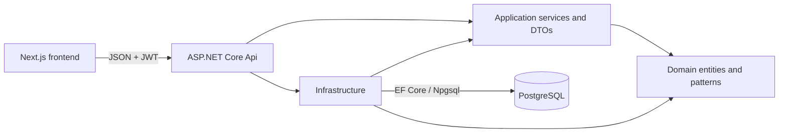
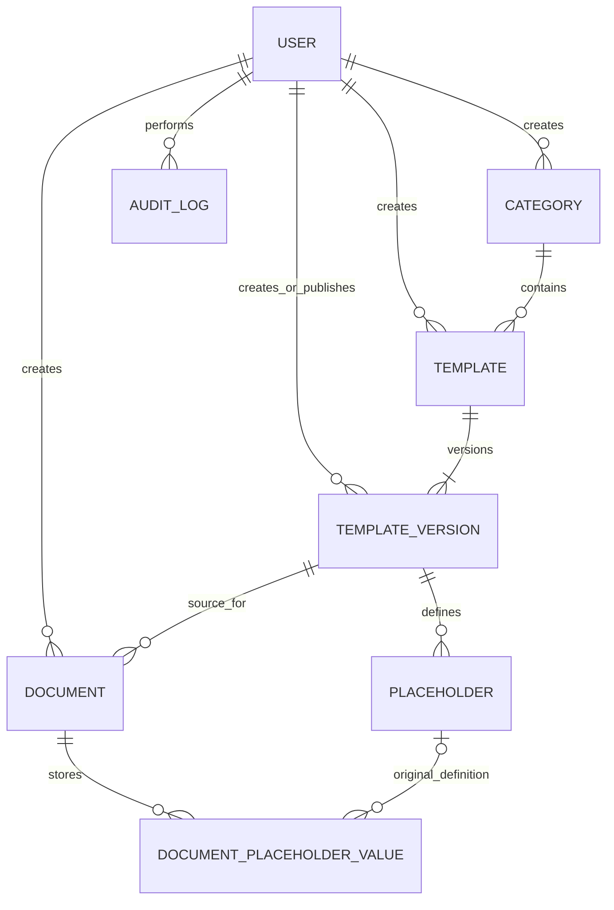
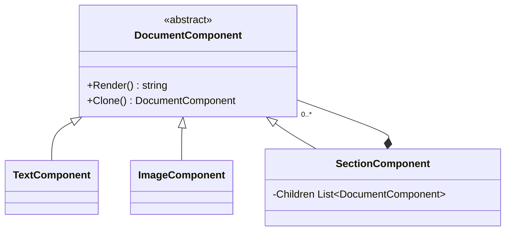

# Architecture

Status: **implemented architecture through Phase 6D; reviewed at the Phase 7
checkpoint**.

This document is an implementation view of the approved model in `AGENTS.md`.
The repository does not contain a separate approved ERD or Class Diagram file;
the diagrams below were verified against the Domain entities, EF Core
configurations, migration, application services, API controllers, and frontend
integration. If a separately approved diagram is added later, it must be
reconciled before a breaking model change.

## System structure

Dependencies point inward: Domain has no EF Core or API dependency;
Application coordinates use cases and owns transport DTOs/interfaces;
Infrastructure implements persistence, JWT, hashing, rendering, and repository
interfaces; Api handles HTTP, authorization, validation boundaries, middleware,
Swagger, CORS, and health routing. Controllers delegate workflows to
Application services.

## Domain and persistence model

The database contains `Users`, `Categories`, `Templates`, `TemplateVersions`,
`Placeholders`, `Documents`, `DocumentPlaceholderValues`, and `AuditLogs`.
Important enforcement is split deliberately across layers:

- unique indexes protect `User.Username`, `User.Email`,
  `(TemplateVersion.TemplateId, VersionNumber)`, and
  `(Placeholder.TemplateVersionId, Key)`;
- a filtered unique index permits at most one current TemplateVersion per
  Template;
- `CK_TemplateVersions_CurrentRequiresPublished` prevents a Draft version from
  being Current;
- domain methods prevent Published TemplateVersion mutation and Finalized
  Document mutation;
- historical relationships use `Restrict`, except the optional Placeholder
  reference on a saved value uses `SetNull` while snapshot fields remain;
- no public workflow hard-deletes Templates, TemplateVersions, Documents,
  Users, Categories, or AuditLogs. The only API delete operation removes a
  Placeholder from a Draft version that has no historical use.

## Required design patterns

### Prototype

`IPrototype<Document>` is implemented by `TemplateVersion`. `Clone()` produces
a new Draft `Document`, preserves the source `TemplateVersionId`, copies the
content, creates a new identity, and does not share mutable collections with the
source. Placeholder snapshots are created on the independent Document when its
values are saved. Document creation calls the Prototype workflow in the
Application layer rather than mapping ad hoc in a controller.

### Composite

Leaf and section components render through one abstraction, and section cloning
deep-copies the child tree. Persisted content remains in the approved `Content`
fields; the Composite does not introduce ERD tables.

### Strategy

`PlaceholderValidator` resolves one `IPlaceholderValidationStrategy` for each
approved `PlaceholderDataType`: Text, Number, Date, and Email. Document preview
and finalization use this context for typed validation. Required-value handling
remains centralized and adding a data type requires a focused strategy rather
than a controller conditional.

## Application workflows

- `AuthenticationService` validates active users and verifies password hashes.
- `TemplateService` exposes only Active templates with one current Published
  version to author workflows.
- `DocumentService` creates through Prototype, enforces ownership, validates
  through Strategy, renders HTML, finalizes atomically, and downloads HTML.
- `AdminCatalogService` manages Category and Template metadata with audit logs.
- `AdminTemplateVersionService` manages Draft versions and placeholders,
  publishing, current selection, and audit logs.
- `AdminUserService` changes activation and role, blocks invalid self-management,
  and records audit logs.

The REST surface is defined in `docs/API_CONTRACT.md`. All current Admin routes
require the `Admin` role; author Documents remain owner-scoped even for Admins.

## Frontend architecture

The Next.js App Router separates public authentication from the guarded
workspace. Axios calls are isolated under `services/`; feature query modules
wrap them with TanStack Query; route components assemble feature screens.
React Hook Form and Zod handle interactive form state and client feedback while
the API remains authoritative.

JWT state is currently stored in browser local storage and reused by the Axios
client. A `401` clears that state and returns the user to login. This is an MVP
choice and a production security consideration, not an architecture invariant.

The Admin Draft TemplateVersion editor uses TipTap and persists HTML. Published
versions render read-only. The author Document editor currently uses a plain
content field; planned Phase 6F must preserve Draft/Finalized and
Prototype-independence rules when adding rich text.

## Areas that require revisiting after planned phases

- **Phase 6E:** authentication sequence, token/session ownership, login/register
  DTOs, logout semantics, route guards, security risks, and diagrams.
- **Phase 6F:** Document editor component boundaries, HTML sanitization policy,
  rendering/preview pipeline, accessibility behavior, and Composite mapping.
- **Phase 6G:** user-creation DTOs, password initialization policy, audit actions,
  seed/demo account assumptions, and Admin UI flow.
- **Optional permissions:** authorization policies, JWT claims, endpoint matrix,
  frontend affordances, and tests. The current two-role model must not be
  silently reinterpreted as fine-grained RBAC.
